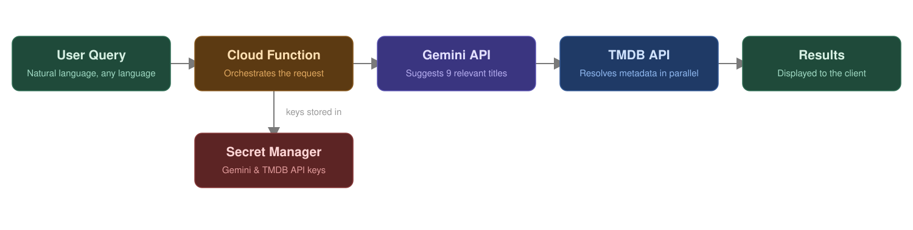

# Collaborative Watchlist App

A collaborative Progressive Web App (PWA) to build, share, and explore movie & TV show watchlists with friends, featuring an AI-powered semantic search.


## Overview

Users can create shared watchlists, invite members, track movies and TV shows as seen or not seen, and search for content either by title or by describing what they feel like watching in natural language.


## Features

- Shared watchlists with member management and invitations by username
- Movie and TV tracking with seen / not seen status, filterable by content type
- Classic search with debounced live results from the TMDB API
- Magic search (AI-powered)
- User accounts with authentication, profile, and viewing history
- Installable PWA with custom icons and splash screens


## ✨ Magic Search

TMDB's search API only matches exact titles and can't interpret intent — there's no way to ask for "something melancholic with great cinematography." Magic Search adds that layer through a dedicated pipeline:



The flow:

1. The user describes what they're in the mood for, in any language
2. A Cloud Function sends the query to **Gemini**, which returns a list of relevant titles
3. Each title is resolved against the **TMDB** API in parallel to fetch real metadata (poster, rating, overview...)
4. Results are returned to the client and displayed like any other search

Gemini and TMDB API keys are never exposed to the client — every request goes through the Cloud Function, with both keys stored in Secret Manager.


## Tech Stack

- **Frontend**: Angular 19

- **Backend / Infrastructure**: Firebase (Authentication, Firestore, Cloud Functions), Google Gemini API, TMDB API

- **Test & Workflow**: Vitest, GitHub Actions


## Project Structure

```
src/app/
├── core/
│   ├── guards/              # authGuard, watchlistGuard
│   └── interceptors/        # TMDB auth header injection
├── features/
│   ├── pages/                # Watchlist, Search, Trendings, Profile, Access...
│   └── popups/                # Members, new watchlist, media details...
└── shared/
    ├── components/           # Reusable UI (card, navbar, popup, button...)
    ├── services/             # Auth, Watchlist, Filter, Navbar, TMDB
    ├── pipes/                # Date, runtime, genre, rating formatting
    ├── models/               # Interfaces and enums
    └── utils/

functions/
└── src/index.ts             # Cloud Function: AI semantic search (Gemini + TMDB)
```

A few notable choices:

- **Guards** — `authGuard` protects private routes, `watchlistGuard` ensures a valid active watchlist before accessing protected pages.
- **Interceptors** — `tmdbInterceptor` automatically attaches the TMDB auth header to outgoing requests, keeping that logic out of services.
- **Services** — business logic and Firestore/HTTP access live in dedicated injectable services, exposing signals and observables consumed by components.
- **Routing** — every route is lazy-loaded via `loadComponent` to keep the initial bundle small.

---

## Testing

[](https://codecov.io/gh/wajrock/watchlist)

Tests focus on business logic, conditional rendering, and edge cases rather than a uniform global percentage.

| Metric     | Coverage | Detail      |
|------------|----------|-------------|
| Statements | 98.05%   | 1108 / 1130 |
| Branches   | 94.47%   | 325 / 344   |
| Functions  | 97.08%   | 300 / 309   |
| Lines      | 98.48%   | 975 / 990   |

Full report on [Codecov](https://codecov.io/gh/wajrock/watchlist).


## CI/CD

Two GitHub Actions workflows:

- **`tests.yml`** — runs on every push to `develop`. Generates a placeholder `environments.ts` (needed for builds, but containing no real credentials since Firebase/TMDB are mocked in tests), runs the Vitest suite with coverage, and uploads results to Codecov.
- **`deploy.yml`** — builds and deploys the production app, generating the real `environments.ts` at build time from GitHub Secrets.

## Author
 
**Thibaud Wajrock**
 
[Portfolio](https://wajrock.me) | [GitHub](https://github.com/wajrock) | [LinkedIn](https://www.linkedin.com/in/wajrock)

## License

Personal portfolio project. Feel free to explore the code, but please don't reuse it commercially without permission.
